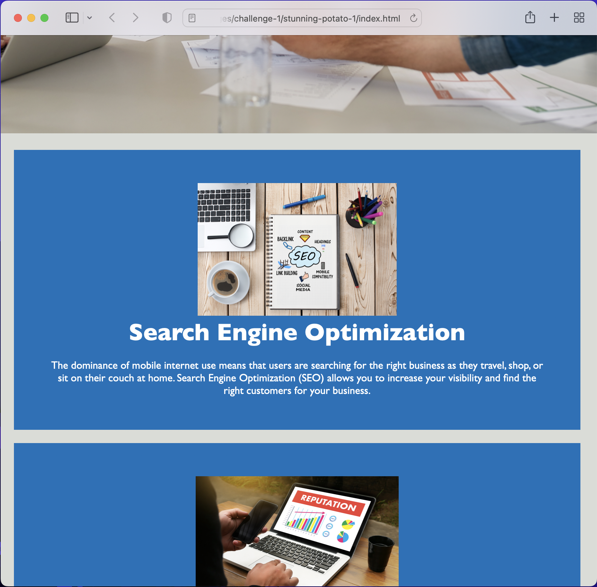
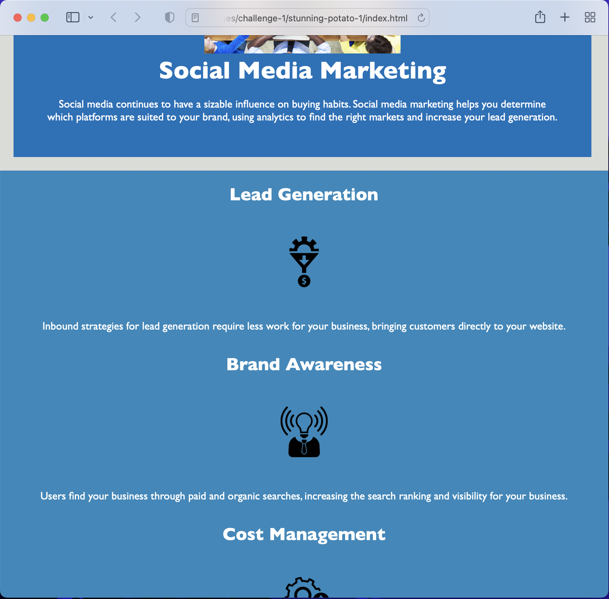

# stunning-potato-1

Challenge 1 demonstrates a knowledge of accessibility standards when browsing a webpage from different sizes of screens. 

# Description

Using the skills and knowledge in advanced CSS we've been studying for the past two weeks in bootcamp, I edited the starter code for a mockup landing page for the company 'Horiseon' to be able to adjust to the screen of any device (PC, tablet, smartphone). 

Creating an accessible webpage means giving the design flexibility through semantics. Each part of the webpage is individually defined and styled. I was able to use the @media property to define the changes that would be made for the adjustments. 

Instead of applying these changes at standard screen sizes (992px, 768px, etc), I made the changes at 1020px and 900px. This was due to the size and overlapping of the text, and the changes had to be made at a wider width to avoid imperfections. 

The navigation comfortably shifts from an inline display to column so as not to overlap on the image, the body text fills in to avoid awkward spacing, and the sections rearrange from a spread to a column format while also automatically adjusting the size of the boxes. Lastly, the aside shifts from the right side of the page to below the main content. 

With these newly added features, Horiseon demonstrates that they keep the user in mind and can successfully displays their services on any platform. 

# Installation

N/A

# Usage

The user can comfortably use the Horiseon website from any device! 

To test the accessibility features of the webpage, enter this link (https://hipster-rufus.github.io/stunning-potato-1/) into any browser and drag the window to your preferred size. 

1. Navigation list display changes from inline to block:

2. Contents adjust to the shrinking size of the screen by filling in the page and aligning text to center:

3. Aside moves to the bottom of the webpage:

# Credits

Just me. 

# License

N/A
